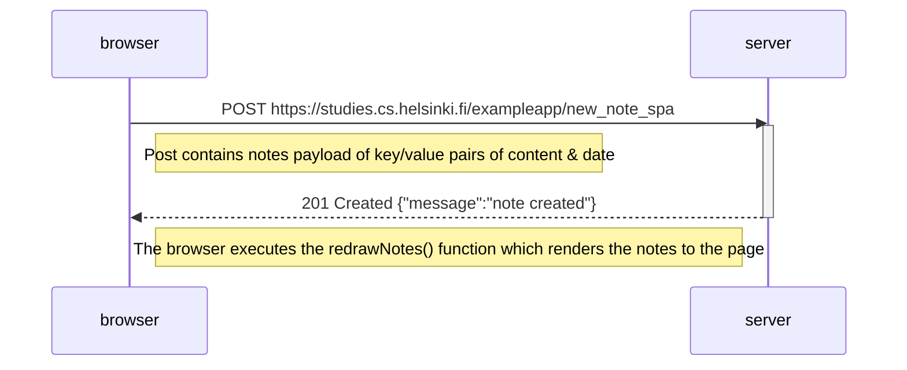

```mermaid
sequenceDiagram
    participant browser
    participant server

    browser->>server: POST https://studies.cs.helsinki.fi/exampleapp/new_note_spa
    activate server
    Note right of browser: Post contains notes payload of key/value pairs of content & date
    server-->>browser: 201 Created {"message":"note created"}
    deactivate server

    Note right of browser: The browser executes the redrawNotes() function which renders the notes to the page
```